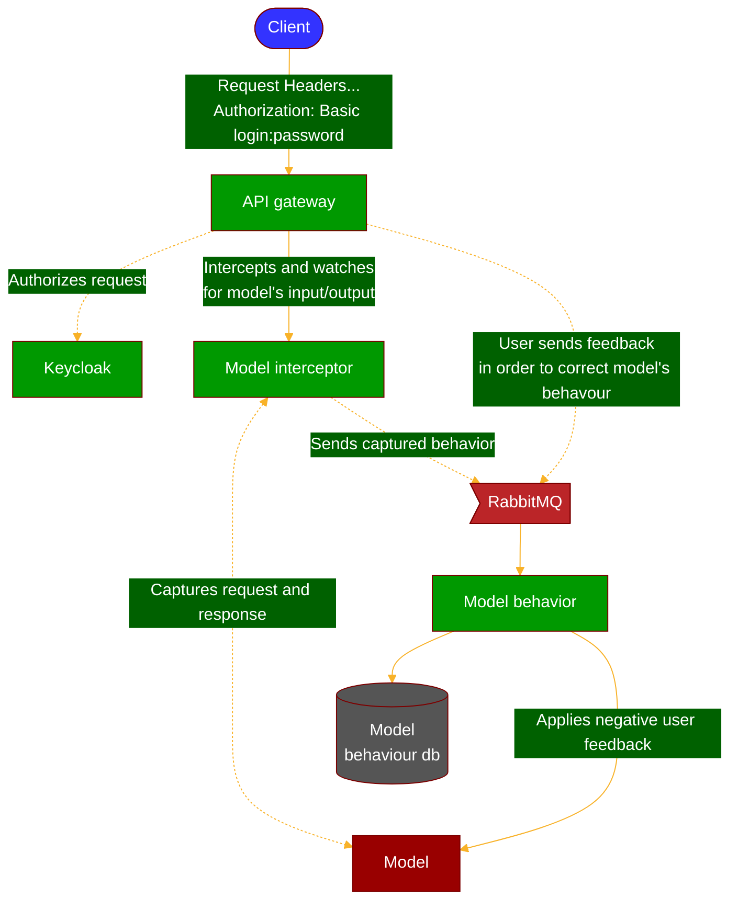
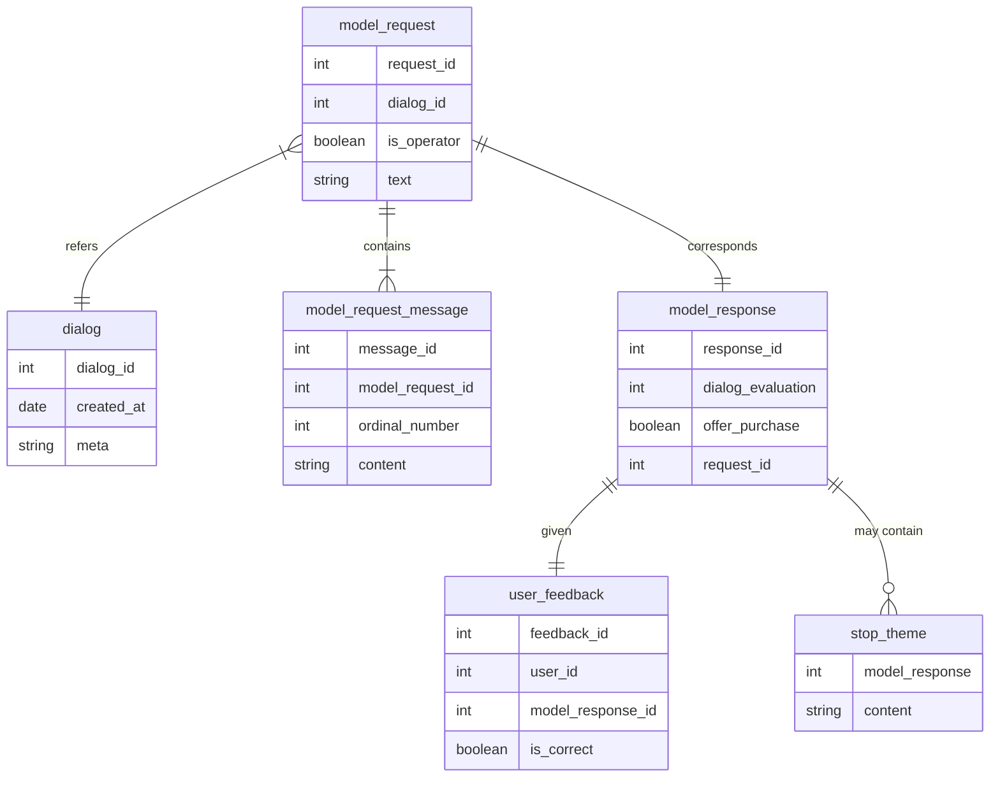

# Summary

Чтобы запустить данное решение локально, необходимо вызвать следующие команду
### docker-compose
`make up`

### kubernetes
TODO: need to release
```
helm repo add gazprom-mrk https://gazprom-charts.obs.ru-moscow-1.hc.sbercloud.ru
helm install gazprom-mrkt gazprom-mrkt/gazprom-mrkt
```

# Компоненты системы

- backend:
  - Сервис, отвечающий за статистику вызова и фидбэк модели [model-behavior](backend/model-behavior)
  - Сервис, отвечающий за вызов модели [model-interceptor](backend/model-interceptor)
  - Единый gateway осуществлящий аутентификацию [api-gateway](backend/api-gateway)
- ml:
  - Вся ml модель [ml-service](ml)
- frontend:
  - Бэкоффис [frontend](frontend)

# Marketing bot

## API
* ### `POST /api/model/evaluate`
    Endpoint used to run the model.
* ### `POST /api/feedback/`
    Allows user to send a feedback for a specific model response which can be used to train model. 
    Currently only negative feedback will be used. 
* ### `GET /api/model/query/model-request?page=:pageNum&size=:pageSize&dialogId=:dialogId`
    Lists all requests with responses. :dialogId may be used to select request for specific dialog.
* ### `GET /api/model/query/model-request/:requestId`
    Provides complete model request information (dialogId, messages, operator flag, text) and model response information (dialog evaluation, stop topics and offer purchase flag).

## Diagrams

### Microservices



### Domain ER diagram 


