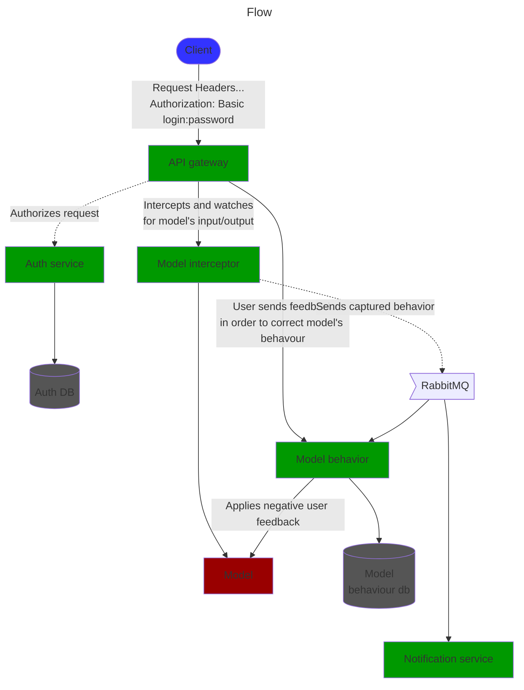

# Marketing bot

# Microservices diagram

```mermaid
---
title: Flow 
---
flowchart TD
client(["Client"])
api_gateway["API gateway"]
auth["Auth service"]
auth_db[("Auth DB")]
model_api["Model"]
model_interceptor["Model interceptor"]
model_behavior["Model behavior"]
model_behavior_db[("Model 
behaviour db")]
rmq>RabbitMQ]
notification_service["Notification service"]


client-->|Request Headers...
Authorization: Basic login:password|api_gateway
api_gateway-.Authorizes request.->auth
auth-->auth_db
api_gateway--"Intercepts and watches 
for model's input/output"-->model_interceptor
api_gateway--"User sends feedback
in order to correct model's behavour"-->model_behavior
model_interceptor-->model_api
model_interceptor-."Sends captured behavior".->rmq
rmq-->model_behavior
rmq---->notification_service
model_behavior --> model_behavior_db
model_behavior--"Applies negative user feedback"-->model_api

style client fill:#33F
style model_api fill:#900
style auth fill:#090
style model_interceptor fill:#090
style api_gateway fill:#090
style model_behavior fill:#090
style notification_service fill:#090
style auth_db fill:#555
style model_behavior_db fill:#555
```

