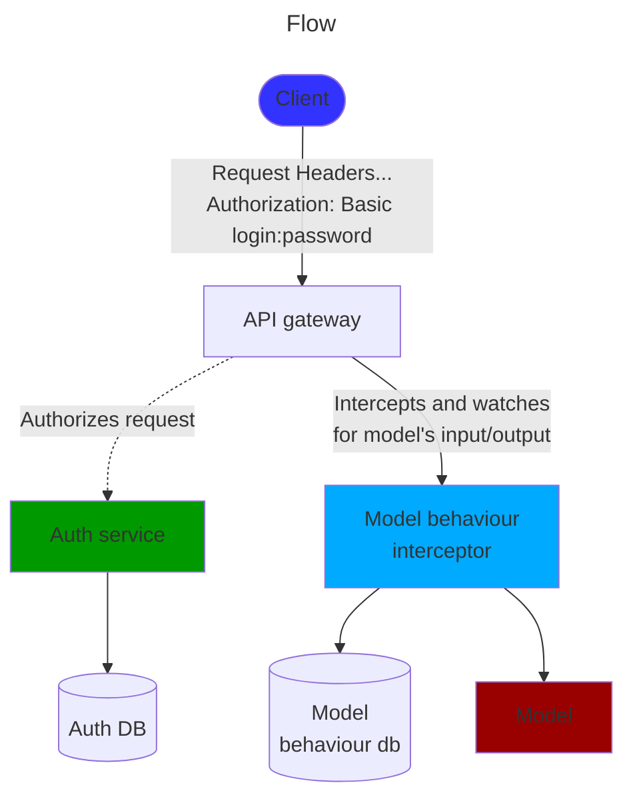

# Marketing bot

# Microservices diagram

```mermaid
---
title: Flow 
---
flowchart TD
client(["Client"])
api_gateway["API gateway"]
auth["Auth service"]
auth_db[("Auth DB")]
model_api["Model"]
model_behaviour_interceptor["Model behaviour 
interceptor"]
model_behaviour_db[("Model 
behaviour db")]

client-->|Request Headers...
Authorization: Basic login:password|api_gateway
api_gateway-.Authorizes request.->auth
auth-->auth_db
api_gateway--"Intercepts and watches 
for model's input/output"-->model_behaviour_interceptor
model_behaviour_interceptor --> model_behaviour_db
model_behaviour_interceptor-->model_api

style client fill:#33F
style model_api fill:#900
style auth fill:#090
style model_behaviour_interceptor fill:#0AF

```

