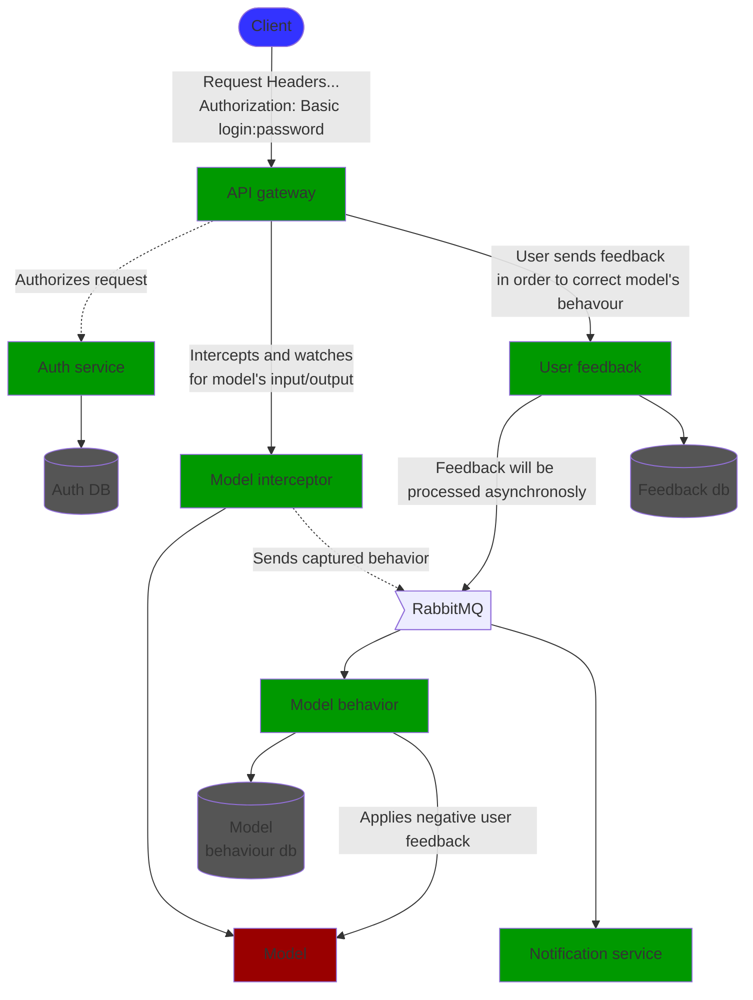
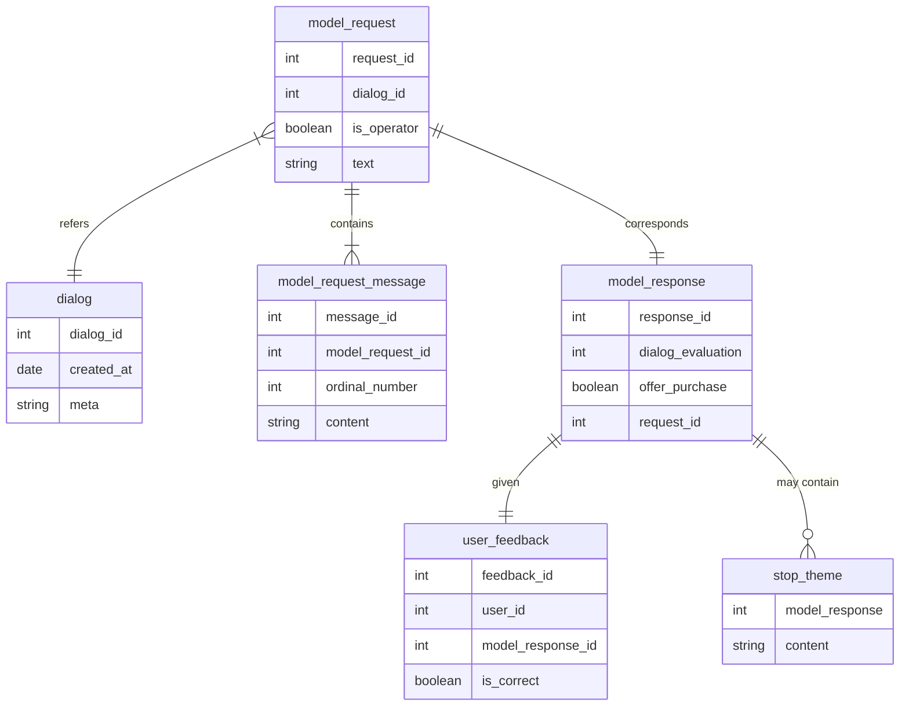

# Marketing bot

## API
* ### `POST /api/model/evaluate`
    Endpoint used to run the model.
* ### `POST /api/feedback/`
    Allows user to send a feedback for a specific model response which can be used to train model. 
    Currently only negative feedback will be used. 
* ### `GET /dialogs`
    Lists dialogs
* ### `GET /dialogs/:dialogId`
    Brief information about dialog: creation date and collection of requests performed for the dialog.
* ### `GET /dialogs/:dialogId/requests/:requestId`
    Provides complete model request information (dialogId, messages, operator flag, text) and model response information (dialog evaluation, stop topics and offer purchase flag).
* ### `POST /users/invite`
    Invites a user using specified email

## Diagrams

### Microservices

### Domain ER diagram 

