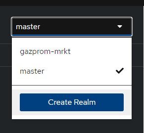
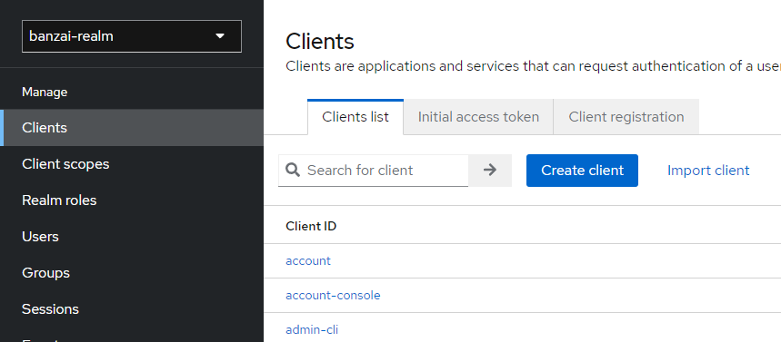
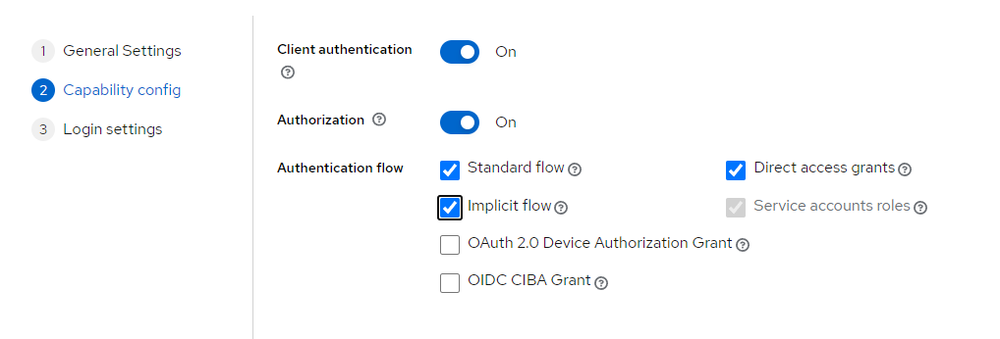
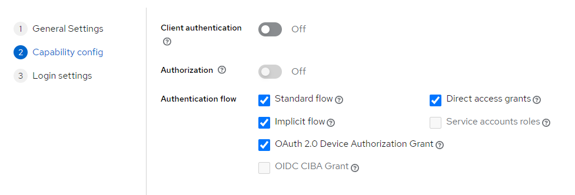
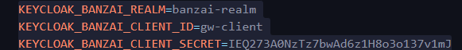

## Keycloak 
Keycloak используется как Authorization Provider и SSO сервис, в котором можно управлять пользователями.

Для работы приложения необходимы **Realm** и **Client**. Realm - это то область в которой находятся пользователи, роли и клиентские приложения, Client - это непосредственно клиентское приложение, которое обращается к Keycloak, с той или иной целью (например валидация и получение токена).
1. Чтобы создать realm для приложения необходимо войти в качестве администратора в панель администрирования Keycloak.

2. Создать realm, указав его наименование
3. Создать двух клиентов: один для SPA, которое будет получать токен доступа от Keycloak, другой клиент для API Gateway, который будет верицифировать указанные credentials пользователя в Basic Auth.

    1. Указать Client ID, который будет тем самым client_id, в большинстве типов авторизаций.
    2. Для клиента "gateway-client", который авторизует запрос по Basic Auth нужно поставить следующие настройки:
    
    3. Для клиента "webapp", который использует фронтенд приложение:
    
    4. Настроить переменные окружения с credentials клиентов. Credentials "gateway-api" указываются в конфигурации шлюза
    
